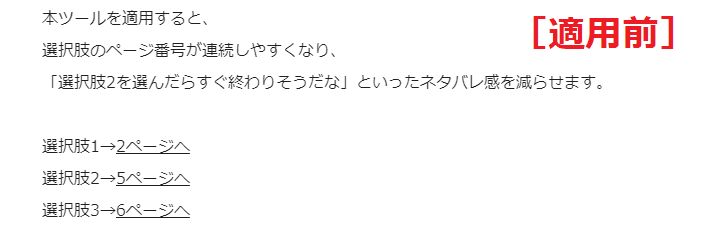

# ゲームブック小説ページソート
本ツールは、作品投稿サイト pixiv にゲームブック小説（分岐小説）を投稿する際に利用可能な、作品内のページ順を”いい感じ”に並び替えてくれるツールです。

||
|:-:|

||
|:-:|

本ツールの適用後は、選択肢に早く登場した順番でページが並び替わります。より技術的に言えば、第1ページをスタートとして小説内のリンクを幅優先探索で走査したときの訪問順になります。

# 使い方
1. PC内にお好みのフォルダを作成し、プロジェクト内のファイルをフォルダ内にダウンロードしてください。
2. webブラウザで index.html を開いてください。
3. ゲームブック小説の本文をテキストボックスに貼り付けて、「変換を実行」ボタンをクリックしてください。

# 注意事項
- [jump:\*\*] タグにて参照されていないページは削除されます（第1ページは例外）。  
ページ移動は必ず [jump:\*\*] タグで繋げてください。
- 変換結果の第2ページにはデフォルトで空白ページが挿入されます。  
読者への注意喚起を加筆するなど、ご自由にご利用ください。  

第2ページへの記入例：
>※ページ移動にはページ内リンクをご利用ください。
>[jump:1]

# 利用規約
　本プロジェクトは MITライセンス のもとで公開されています。